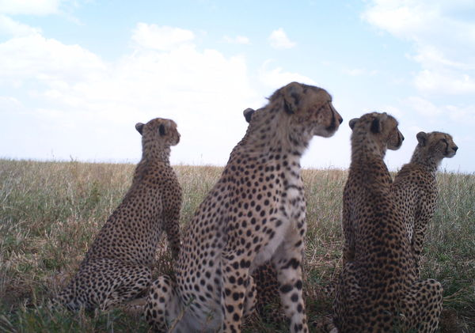
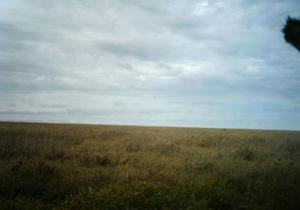
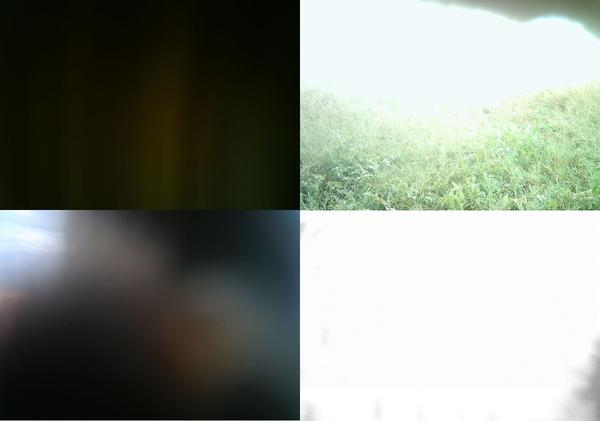
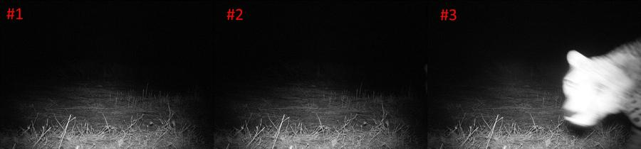

# Spotted Cat Challenge

Detailed description is in [competition-info](./competition-info) directory. Please, have a look at it.

## Used tools 

* [Python 2.7.6](https://www.python.org/about/)
* [OpenCV 2.4.9](http://opencv.org/) - operations on images, extraction of Speed Up Robust Features
* [Mahotas 1.2.1](http://mahotas.readthedocs.org/en/latest/) - extraction of Local Binary Patterns
* [PyCharm 3.4 Community Edition](http://www.jetbrains.com/pycharm/) - Python IDE
* [scikit-learn](http://scikit-learn.org/stable/) - an estimator, fine-tune the parameters of the estimator, images' classification
* [NumPy](http://www.numpy.org/) -  the fundamental package for all internal computations

All Python packages are taken as binary files from [Unofficial Windows Binaries for Python Extension Packages](http://www.lfd.uci.edu/~gohlke/pythonlibs/).

## Current approach for spotted cats detection

**Rearranging train data set.** There are images in data set that labeled by organizers as including a spotted cat, but, in fact, 
  presenting hardly located part of it (small tip of a tail, gray blurred something in front of camera) or even not including a cat.
  We excluded such images from a train data set.
    
### Examples of the questionable sets

All the next images labeled by organizers as including a cat. 

#### Small tip of tail

#### Blurred something

#### Images in a sequence 

      
After that step, number of images with a cat was reduced from 2621 to 2333.

**Image preprocessing:** histogram equalization, convert to grayscale, reduce image size proportionally to width 300 pixels

**Feature extraction:** Bag Of Words based on SURF descriptors + Local Binary Patterns form a combined feature for each image

Trained **Gradient Boosted Trees** takes as input the feature vector and makes a prediction based on it. Prediction is 
  a real number from interval [0, 1]. The closer the prediction value to 1 the more likely threre is a spotted cat on 
  corresponding image

## The ways to improve detection quality

* **Convolutional neural networks**. We have used weight files from [OverFeat project](https://github.com/sermanet/OverFeat),
but this approach did not give us satisfactory results on the whole image set (AUC is about 0.59). This is primary because 
the network was trained on ImageNet with a huge amount of categories. For the current competition much more reasonable approach
would include either feature extraction step or training on the challenge data set.
 
* **Describing images in terms of relations between spots**. Find locations on the image that are similar to a spot, 
build a graph based on spatial relationship between the locations, extract features (for example, [real number invariants](http://en.wikipedia.org/wiki/Graph_property#Real_number_invariants)).  

* Many images in the competition data look like image sequences (somebody moves from left to right, 
camera catches the movement in some number consecutive images). It seems that **taking into account the movement** 
would also help to improve quality of the detection. Also the next logic can improve performance: if there is 
at least one image in a sequence predicted as including a spotted cat, mark rest of the images in the sequence as including the cat.     

 

